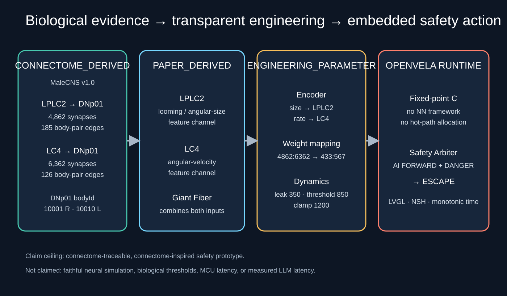
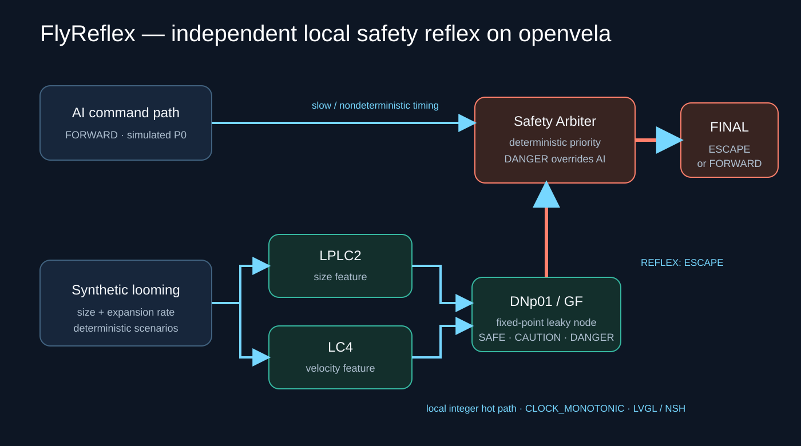

# FlyReflex

## What it is

A connectome-traceable local safety reflex layer for AI-controlled embodied systems.

面向 AI 控制的具身系统、具有连接组来源可追溯性的本地安全反射层。

FlyReflex 是一个运行在 openvela 上的独立安全反射层：上层 AI 仍可输出 FORWARD，但当本地视觉输入出现快速逼近风险时，轻量反射引擎会在本地生成 ESCAPE，Safety Arbiter 随即输出 REFLEX_OVERRIDE。项目不声称模拟完整果蝇大脑；它把真实 MaleCNS 连接组拓扑压缩成一个透明、确定性、可迁移到 MCU 的工程原型。

## 选题方向

**自定方向：面向具身智能设备的端侧安全反射。** 项目使用 openvela 的 NuttX 应用运行环境、LVGL 图形能力、framebuffer、NSH 命令和单调时钟，在模拟器固件内完成本地感知计算、指令仲裁、实时可视化与延迟测量。反射核心不依赖云端推理；另提供官方 `ai_agent` 的运行时 Guard Skill，通过小米 MiMo 发起安全状态查询和模拟前进请求。该集成的实测状态和限制见 [Guard 接入与验收](docs/AGENT_GUARD.md)，不能把浏览器里的固定延迟 Agent 模型当成真实 LLM。

## 浏览器 3D 演示

浏览器提供双场地交互避障对比：左侧 Agent 延迟模型，右侧同一模型加即时神经反射。拖动蓄力发射相同障碍球，调节速度与加速度，统计两侧碰撞和躲避结果。本机演示与 openvela 实时模式均调用 C 核心，原有 LVGL 界面与安全判断逻辑保持不变。

先完成下文主机 C 编译，再在项目根目录执行 `npm ci --prefix web` 和 `python tools/web_bridge.py`，访问 <http://127.0.0.1:8088>。实时连接、数据定义及验收步骤见 [Web 演示说明](docs/WEB_DEMO.md)。

## Problem

AI Agent 擅长任务理解和规划，但推理耗时、网络依赖和偶发停顿使其不适合作为唯一的毫秒级安全闭环。FlyReflex 把安全响应从较慢且时延不确定的认知路径中解耦：

    AI path:       slow cognition / planning (P0 uses an explicitly simulated command)
    FlyReflex:     local sensing / reflex / deterministic arbitration
    Actuator path: always receives the arbiter's final command

## Core Idea

危险场景的关键输出为：

    ai=FORWARD
    state=DANGER
    reflex=ESCAPE
    final=ESCAPE
    decision=REFLEX_OVERRIDE

安全与缓慢接近场景保持 final=FORWARD。输入非法时 fail-safe 输出 STOP。

既有候选版 openvela ARM64 模拟器实测：reflex compute median 1.280 us、P95 1.360 us、P99 2.816 us；event-to-arbiter median 2.320 us、P95 2.448 us、P99 5.312 us。它们是历史候选结果，不是 MCU latency，也不是最终 RC 验收。最终结果以 `benchmark/final_*.log` 与 [RC 记录](docs/RELEASE_CANDIDATE.md) 为准。

## Biological Basis

FlyReflex 使用一个最小三节点聚合回路：

    angular-size proxy --------> LPLC2 aggregate --+
                                                   +--> DNp01 / Giant Fiber --> ESCAPE
    angular-velocity proxy ----> LC4 aggregate ----+

MaleCNS v1.0 直接连接数据（2026-09-18 查询）：

| Direct edge | Synapses | Body-pair edges | Runtime normalized weight |
|---|---:|---:|---:|
| LPLC2 → DNp01 | 4,862 | 185 | 433 / 1000 |
| LC4 → DNp01 | 6,362 | 126 | 567 / 1000 |

DNp01 / Giant Fiber 两侧 bodyId 为 10001（R）和 10010（L）。完整的 311 条细胞对边、原始 API 响应、查询语句和再生成脚本均已提交。

功能依据来自 Ache et al.：LC4 提供 angular-velocity 分量，LPLC2 提供 angular-size 分量，两者直接汇入 GF。LPLC2 对径向扩张运动的选择性另有实验研究支持。详细 claim/evidence/usage 表见 docs/SCIENTIFIC_BASIS.md。

## Engineering Model



CONNECTOME_DERIVED：

- 数据集 male-cns:v1.0；
- LPLC2、LC4、DNp01 类型与个体 bodyId；
- 311 条 LPLC2/LC4 → DNp01 直接边；
- 4,862 与 6,362 的聚合突触计数；
- 按两类聚合突触数占比计算出的 433:567 相对权重。

PAPER_DERIVED：

- LPLC2 / LC4 是 looming feature channels；
- LPLC2 提供 size-related 分量，LC4 提供 velocity-related 分量；
- Giant Fiber 汇合输入并参与快速逃逸起飞。

ENGINEERING_PARAMETER：

- synthetic looming 序列；
- size/rate 到节点活动的归一化编码；
- 离散泄漏系数、阈值、clamp；
- DANGER → ESCAPE 和非法输入 → STOP；
- P0 的 AI FORWARD 与其延迟都是模拟，不是 LLM benchmark。

全部参数见 data/engineering/model_params.csv。

## System Architecture

三层部署边界：openvela runtime 内运行 C 反射、仲裁、Guard 和 LVGL；宿主机 Python bridge 转发数据；浏览器负责 3D 交互与几何输入生成。Python 和浏览器不运行在 openvela 内。实模式显示来源并等待目标 C 应答，断线冻结，不伪造实时神经活动。



    deterministic synthetic looming
                 |
                 v
      size/rate engineering encoder
           |                 |
           v                 v
       LPLC2 aggregate    LC4 aggregate
           \                 /
            \               /
             v             v
        fixed-point leaky DNp01/GF node
                 |
          SAFE / CAUTION / DANGER
                 |
                 v
    simulated AI -----> Safety Arbiter -----> final command
       FORWARD            deterministic         FORWARD/ESCAPE/STOP

热路径使用固定大小结构与整数运算，不分配内存。benchmark 的样本数组只在 benchmark 命令启动时分配。

## AI Integration

真实链路：Xiaomi MiMo → Guard Skill → openvela → Safety Arbiter（安全仲裁器）→ 实际反射结果。Skill 部署于 `/data/agent/skills/flyreflex-guard.md`；新鲜 DANGER 下 FORWARD 请求被覆盖为 ESCAPE；无快照或超过 1500 ms 则 STOP。LLM 仅能调用白名单接口，不能绕过仲裁器。

候选版真实调用包含三轮模型请求、两次工具调用，总计约 18 秒；只是单次流程记录，不是典型 Agent 性能。浏览器左侧是 simulated-delay control model（模拟延迟控制模型），不是 MiMo benchmark。两条路径不可混作速度对比。部署、测试及失败修复见 [AGENT_GUARD](docs/AGENT_GUARD.md)。

## openvela Usage

openvela 不是标签：FlyReflex 作为 NSH 内建应用被交叉编译进现有 goldfish ARM64 固件，并使用：

- NuttX/openvela 应用与任务运行环境；
- CLOCK_MONOTONIC 本地时钟；
- NSH 命令与标准日志；
- LVGL + openvela framebuffer 的实时 dashboard；
- openvela simulator 中的真实本地运行时间测量。
- 应用任务与子任务退出状态、LVGL 定时更新；Guard Skill 调用本地 C 安全仲裁器。

## Build

### Host

主机版用于快速回归，不代表 openvela latency：

    cmake -S . -B build -DCMAKE_BUILD_TYPE=Release
    cmake --build build -j4
    ctest --test-dir build --output-on-failure
    ./build/flyreflex_host demo all
    ./build/flyreflex_host bench 1000

### openvela contest workspace

官方比赛仓通过 `contest2026_492_qunqingxueyuan.xml` 中的 manifest linkfile 将 `app/flyreflex` 映射到：

    packages/demos/contest2026_492_flyreflex

使用组委会提供的标准方式获取完整工作区：

    repo init -u https://github.com/open-vela/contest2026_492_qunqingxueyuan \
      -b dev-ai-contest-2026 -m contest2026_492_qunqingxueyuan.xml
    repo sync -c -j8

启用 Application Configuration → Packages → Demos → FlyReflex，然后构建：

    ./build.sh vendor/openvela/boards/vela/configs/goldfish-arm64-v8a-ap/ --cmake menuconfig
    ./build.sh vendor/openvela/boards/vela/configs/goldfish-arm64-v8a-ap/ --cmake -j2

启动模拟器：

    ./emulator.sh cmake_out/vela_goldfish-arm64-v8a-ap/

Guard 版本在初始配置后执行（已实际执行此配置与构建路径）：

```bash
bash contest2026_492_qunqingxueyuan/tools/configure_agent_guard.sh
git -C vendor/openvela/boards/vela/libs lfs pull
source build/envsetup.sh
lunch vendor/openvela/boards/vela/configs/goldfish-arm64-v8a-ap cmake_out/vela_goldfish-arm64-v8a-ap
cmake --build cmake_out/vela_goldfish-arm64-v8a-ap -j4
```

此 manifest 的上游默认仓是 open-vela；仅克隆个人 fork 不会自动替换完整工作区中的项目 revision。最终发布以正式分支实际 SHA 为准。

## Run

### CLI 与 LVGL（目标 NSH）

在 NSH 中：

    flyreflex demo safe
    flyreflex demo slow
    flyreflex demo danger
    flyreflex demo recovery
    flyreflex demo all --csv
    flyreflex bench 1000
    flyreflex ui

UI 自动循环 SAFE → SLOW → DANGER → RECOVERY，也可以直接点击顶部四个场景按钮。仪表盘显示 collision risk、LPLC2、LC4、DNp01/GF、AI command、local reflex、robot executes、最终决策和本地端到端延迟。绿色表示 AI 正常控制，黄色表示持续监视，红色表示本地反射已覆盖 AI；终端仅在场景、状态或决策改变时输出一行摘要，不再逐帧刷屏。

最快验收方式：启动 `flyreflex ui` 后点击 `DANGER`，应看到状态区变红、`LOCAL REFLEX = ESCAPE`、`ROBOT EXECUTES = ESCAPE` 和 `REFLEX_OVERRIDE`；再点击 `SAFE`，界面应恢复绿色且最终指令回到 `FORWARD`。

### Browser 与 bridge（宿主机）

```bash
npm ci --prefix web
python tools/web_bridge.py --target-port 10023
```

打开 http://127.0.0.1:8088，选择 openvela 实时。独立模拟器、NSH 网络与本机端口转发见 [WEB_DEMO](docs/WEB_DEMO.md)。本机演示只代表 host-reference，不是 ARM64 数据。

### MiMo Guard（专用测试实例）

```bash
python tools/test_agent_guard.py --port 10024
```

先按 [AGENT_GUARD](docs/AGENT_GUARD.md) 配置对应端口模拟器。密钥用隐藏输入读取；禁止存入仓库、录屏或提交数据盘。已用 ADB 部署 Skill 时加 `--skill-installed`。查看真实 tool trace 与最终回答，不能仅凭模型口头声称成功。

## Test

```bash
ctest --test-dir build --output-on-failure
npm test --prefix web
python -m unittest discover -s tests -p test_web_bridge.py
python tools/release_validation.py build/flyreflex_host
python tools/capture_target_acceptance.py --port 10023
python tools/soak_target.py --port 10023 --seconds 1800 --output docs/evidence/soak-target.json
```

运行目标验收时暂停网页，避免竞争同一目标。synthetic validation 是固定 seed=492 的 100 danger + 100 safe 合成场景，不是相机识别率。目标 NSH 另执行 `flyreflex bench 1000`。最终冻结对应证据见 RC 文档；历史 PASS 不自动升级为 RC PASS。

## Reproduce the connectome extraction

    python3 tools/connectome/fetch_malecns_reflex.py
    python3 skills/flyreflex-provenance/scripts/verify_provenance.py

查询使用 Janelia neuPrint 公开 API 与固定数据集 male-cns:v1.0。若未来数据发生变化，验证脚本会失败，要求人工审核权重而不是静默接受新计数。

## Benchmark

指标从 looming event 被接收到 engine 完成，以及 arbiter 完成时分别取 CLOCK_MONOTONIC 时间戳。输出 min、mean、median、P95、P99、max。主机与 openvela simulator 结果严格分开，见 docs/BENCHMARK.md。

## Repository structure

    app/flyreflex/          openvela app, core, arbiter, CLI and LVGL UI
    data/connectome/        raw response, direct edges, aggregate edges and query
    data/engineering/       explicit model parameters and classifications
    docs/                   architecture, science, provenance, benchmark and demo
    logs/                   development log; official AI export still required
    skills/                 reusable FlyReflex provenance audit Skill
    tests/                  host regression tests
    tools/connectome/       deterministic neuPrint extraction script

## Limitations

- Synthetic looming input, not a real camera.
- No real robot or physical actuator validation; no production safety claim.
- Simulator-first; no claim of measured MCU latency.
- Three aggregate biological nodes, not a full neural simulation.
- Synapse counts set relative structural weights; they are not physiological synaptic efficacy.
- P0 AI command is simulated and no cloud LLM is required for the safety loop.
- Release acceptance and remaining submission blockers are tracked in docs/FINAL_ACCEPTANCE.md; a running local demo does not imply the latest revision is published.

## Future work

Add camera optical-flow input, validate on a low-power MCU/SoC, connect STOP/ESCAPE to a real robot, test richer parallel descending pathways, and compare against a real AI planning path without making safety dependent on the network.

## AI Coding

开发主要使用 Codex；运行时高层 AI 使用 Xiaomi MiMo，两者职责不同。[人工日志导出步骤](docs/AI_LOG_EXPORT_MANUAL.md) 说明官方采集工具、缺失历史会话的限制和隐私检查。

AI participated in requirement extraction, official-rule checking, primary-source research, neuPrint queries, architecture, C implementation, tests, openvela integration, benchmark design, debugging and documentation. The manually exported official AI Coding conversation package must still be placed in logs/ before submission; logs/development_log.md is an engineering summary, not a substitute.

## References

- MaleCNS v1.0 project and download documentation: https://male-cns.janelia.org/download/
- Berg et al., Cell 2026, complete male CNS connectome: https://doi.org/10.1016/j.cell.2026.08.015
- Ache et al., Current Biology 2019, size and velocity encoding: https://doi.org/10.1016/j.cub.2019.01.079
- Klapoetke et al., Nature 2017, radial motion opponency in LPLC2: https://doi.org/10.1038/nature24626
- Official contest overview: https://github.com/open-vela/docs/blob/dev-ai-contest-2026/zh-cn/contest_2026/contest_overview.md
- Official code submission guide: https://github.com/open-vela/docs/blob/dev-ai-contest-2026/zh-cn/contest_2026/code_submission_guide.md
- Official AI Coding log guide: https://github.com/open-vela/docs/blob/dev-ai-contest-2026/zh-cn/contest_2026/ai_coding_log_guide.md

## License

FlyReflex source code is provided under Apache-2.0. MaleCNS data artifacts retain the dataset's CC BY attribution requirements.
第三方依赖和数据说明见 [THIRD_PARTY_NOTICES.md](THIRD_PARTY_NOTICES.md)。
